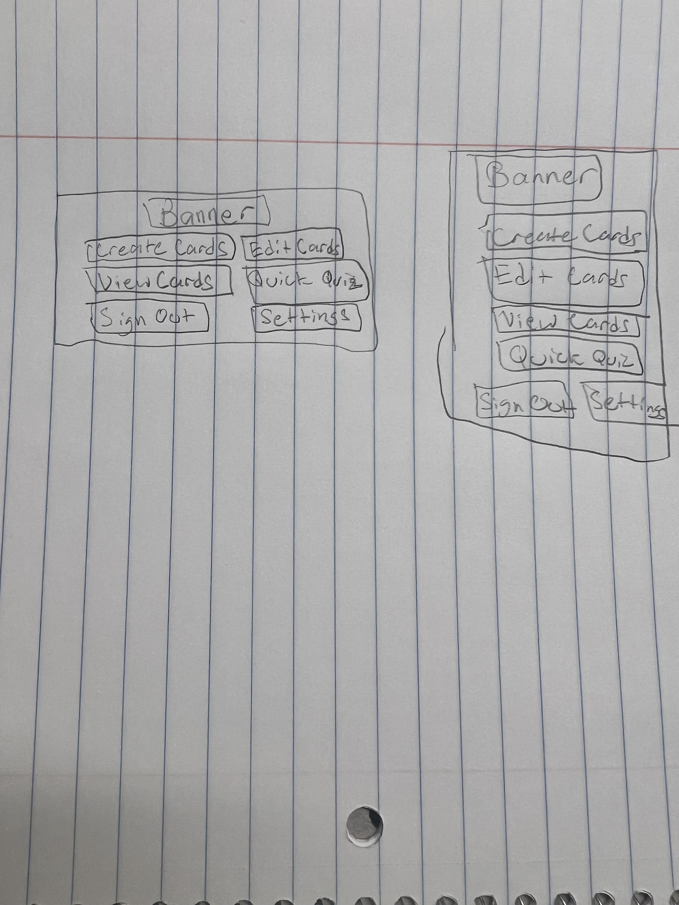

* A/B Test Name: Portrait Mode 
* User Story Number:
* Metric (from the HEART grid): User Feedback, Average Session duration, repeat logins 
* Hypothesis:
As a group, Mind Master is wondering if users would rather use landscape or portrait mode when using the app. If we change the app from portrait mode to landscape mode, then developers will see an increase in average session duraiton and a decrease in churn rate. This is because users like using the app in landscape mode rather than portrait mode 

* Experiment: To start up our experiment, we would create both versions, version A being portrait mode and version B being landscape mode. Then we would launch both versions at the same time with 50% percent of users seeing version A and the other 50% of users seeing version B. After these versions are out for 48 hours we would review the metrics. We will measure the metrics we will be using for both versions. We will measure what the average session duration is, the churn rate, and the amount of repeated logins. Average session duration is measured through the firebase dashboard, churn rate is measured by seeing if the amount of active users increases or decreases on firebase as well. Repeat logins will being tracked through thunkable with each user having data collected about them about how many times they log in. We will also have user feedback. After a certain amount of time the user is on the app, we will prompt the to fill the survey out, which will have quesitons regarding if they like portriat mode or would rather landscape mode and vice versa. 

* Variation: The variation we would like to test is if users like portrait mode or landscape mode better. We would create both variations to send out to our users. We would make all screen in both formats. 

* A/B Test Name: store layout
* User Story Number:
* Metric (from HEART grid): Store ratings
* Hypothesis:
Mind Master would like to determine what store layout leads to the most purchases from its users. Should the purchase button be large with small iages to display what you are buying, or should the images be large with small buy buttons. We believe that the layout with that will lead to more purchases is teh larger image with the smaller buttons as users would be more enticed by the dislays of what they could have.

* Experiment: To begin the experimant we would need to create two versions of the in app store. One version with lareg display images that show off what the users could purchse (colored themes as an example). The other version would have a store layout that has large "purchase" buttons and smaller display windows. We would then lanch bother versions with 50% of users getting the large images and teh other 50% getting the large buttons. we would then wait a few days to collect data and after the days have passed we can look at the results. all utrchases would be tracked through thunkable which would make teh comparison easy to make. We would just need to see which of teh two layyouts lead to more in app purchases and then make that version of teh app our main version.
