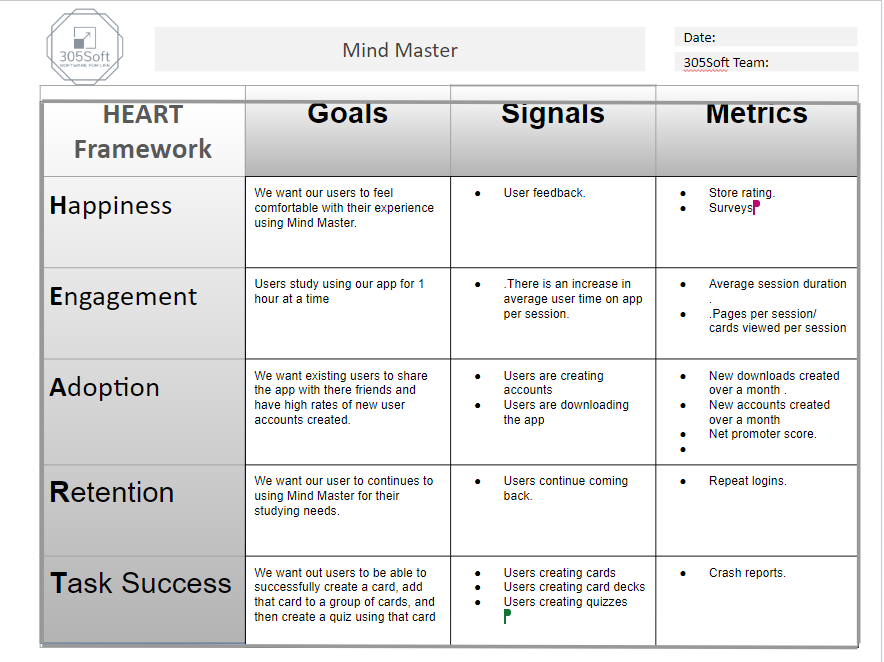

 

* Metric: Store Rating- After a certain amount of time, the app will prompt the user for an out of 5 rating measuring how much they enjoy the app.   
* Metric: Average Session duration- Use firebase analytics to measure the average session length. Specifically, we would look at daily user engagement in google analytics.
* Metric: Cards Viewed Per Session- Us as developers will create a tracking system to keep track of how many cards a user view per session. The system will keep track of how many times a user views a flash card per session. We can then store this on the database and when needed, look back to analyze this metric.
* Metric: Crash reports-  Within firebase analytics you are able to view crash free users. We are aiming for a high crash-free users percentage.
* Metric: Net Promoter Score- After a user uses the app for certain amount of time, the app, Mind Master, will prompt the user with a survey question aksing how likely they would recommend the app to others on a scale of 1-5. We can then store this data in the database to later analyze to determine the net promoter score.  
* Metric: New Downloads/Accounts- By monitoring new downloads/accounts over a span of time such as a month we can see get an idea of our new user growth.
* Metric: Repeat logins- By monitoring repeat logins from registered accounts we can gauge user retention.
